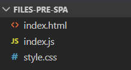
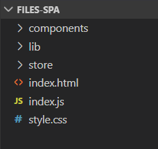

# Single-Page Applications

### **Objective: -**

In this module we'll look at ...

- Some pros and cons of Single-Page Applications
- The comparison between pre-SPA and SPA websites
- Essential file structure and component parts of an SPA
- Stateless vs. State-driven SPA applications
- "Serving up" SPA applications
- Model-View-Update (MVU) architecture

<br>

---

<br>

## Single-Page Applications

A **SPA** (**S**ingle-**P**age **A**pplication) is a web development implementation that allows users to use websites without requesting and loading new pages from a server. SPAs can improve user experience with faster load times since whole websites can be used without any additional loading of pages.

SPAs also create for a separation of concerns allowing front-end developers to develop websites without server-side jobs and back-end developers to develop features without client-side jobs.

**S**earch **E**ngine **O**ptimization (**SEO**) is one potential disadvantage of SPAs. _Some_ SEO Web Crawlers cannot execute JavaScript and therefore cannot access the HTML inside SPAs functional components.

While we are learning SPAs in "_plain_"/vanilla JS, starting with vanilla JS now will make it easier in the future to learn any of the available JavaScript **frameworks** meant for SPAs. Here are a few of the most popular SPA frameworks:

- [Angular](https://angular.io/)
- [React](https://reactjs.org/)
- [Vue.JS](https://vuejs.org/)

<br>

> **NOTE**: Do **NOT** use these frameworks on your capstone, these are just what some of what's available after learning to build an SPA with vanilla JS.

<br>

---

<br>

## Comparing pre-SPA and SPA Websites

<br>

### **Pre-SPA Website**

When we built websites before, all we really "needed" were a few files: our `index.html`, a JavaScript file, and a CSS file.



When developing a website, we also needed `live-server` to **serve** our files locally.

In order to develop our site with more pages/views/content, we needed to add _more_ HTML or content. As we have seen, we can "offload" some HTML content onto JavaScript by using _DOM methods_ to create elements or add content to our page. However, with so few files, each file can grow quite **bloated** with increasingly complex content as our website grows...

<br>

### **SPA Website**

SPAs, on the other hand, involve a great deal more files, yet each individual file contains a much more manageable amount of code.

While more files might sound just as hard to manage, additional files used for SPA are contained within one of three new folders: `components`, `store`, or `lib`.



<br>

### **Essential File Structure of an SPA**

- **`components`** stands for "functional **components**." The `components` folder holds _JS modules_ which _export_ **functions** that populate the HTML document. Each functional component corresponds to a _section_ or page/_view_ of your website.
  - If your site has many "pages"/views, it is common to create a **`views` folder** inside `components` that contains the files for every view/"page".
- **`lib`** represents the an _optional_ **lib**rary of _JS modules_ which _export_ Functions, Classes, Objects, or Arrays that we might need in any of our "main" (`components`, `store`, `index.js`) JavaScript files.
- **`store`** represents the _storage_ of the current **state** of the _data_ that populates our site. **State** (or pieces of it) is _passed into_ the _functional components_, and the functional components use the data from state to populate the site. There is no single way to structure `store`, but generally, each piece of your site that you want to keep track of should have a module in `store`.
- **`index.html`** - the `body` of `index.html` will contain only a `div` with an `id` of `root` (`<div id="root"></div>`) and a `script` tag that links to our `index.js`
- **`index.js`** - the root-level `index.js` file contains the `render()` function that targets the `root` `div`, then calls our functional components to _render_ our site. This `index.js` file also contains our _event listeners_, since we can only target the elements to listen for events after they have been rendered.
- **`style.css`** - _No change_ from pre-SPA web development. We still need only one stylesheet, and all the same selectors and rules apply.

<br>

### **Serving an SPA: Bundlers/`Parcel`**

`live-server` cannot serve JavaScript modules. You may see an error that says `"import statement cannot be used outside a module"` if you attempt to serve an SPA with a "regular" server simulator like `live-server`.

Instead, we need to use a **bundler** to _build_ our SPA. The bundler we will use is called [**Parcel**](https://github.com/parcel-bundler/parcel#readme). Parcel "connects"/compiles all of our files and dependencies into a smaller set of output files that can be used to run our code.

<br>

**To add Parcel to your project:**

1. In your terminal, and in your repo, enter `npm install -d parcel-bundler` to install `parcel` as a development dependency.

```json
// in package.json
"devDependencies": {
    "parcel-bundler": "^1.12.4",
    ...
```

2. Since Parcel is taking the place of `live-server`, we can remove that line from our `devDependencies` (if we didn't install it globally). And since we removed `live-server`, we need a new way to serve our page. In the `scripts` section of `package.json`, we add the following commands: `parcel-build` and `serve`.

```json
// in package.json
...,
"scripts": {
    "parcel-build": "parcel build index.html && cp _redirects ./dist/",
    "serve": "parcel index.html"
  },
...
```

Now, when we enter `npm run serve` into our terminal when inside our project folder, `parcel` serves up our website instead of `live-server`. Entering `npm run parcel-build` "bundles" our files into a smaller set of files inside of a new folder: `dist`.

We need the second part of `parcel-build` ( "`cp _redirects ./dist/`" ) to handle our our SPA navigation - we want any and all "routes" (web.site/_**route**_) to just render `index.html` since our SPA is only a single page. This part of the command tells `parcel` to **c**opy and **p**aste a file named `_redirects` into the `dist` directory it is creating. However, we don't have a `_redirects` file yet. Let's make one.

3. In the root directory of your project, `touch`/create a file named `_redirects` (notice the lack of `.` extension).
4. Inside `_redirects`, add this single line of code: `/* /index.html 200`. This tells `parcel` to _redirect_ **any route** ("`/*`") to `index.html`.
5. Now when we run your `parcel-build` script, we shouldn't get any errors.

<br>

---

<br>

## M-V-U Architecture

**Model-View-Update** architecture is based on the [MVC (Model-View-Controller) pattern](https://developer.mozilla.org/en-US/docs/Glossary/MVC) with a main difference being that MVU architecture maintains _unidirectional_ (one-way) data flow.

- **Model** (_state_) - the current state of the application's data.
- **View** (_components/views_) - the functional components that hold the HTML for displaying the site.
- **Update** (_event listeners_) - event listeners that handle user input and use it to alter the _state_/model.

So, our **model** is passed into and rendered by our **view** which then listens for user input that **updates** the _model_, which is then passed into and rendered by our _view_ which then listens for user input that _updates_ our model, which is then passed into... etc.

<br>

---

<br>

## Activity (instructor): Stateless and State-driven SPAs

The instructor will walk though how to convert a "static" pre-SPA website (in this lesson's Activities folder) into, first, a [stateless SPA site](https://github.com/savvy-coders/Stateless-SPA-example), then, a [state-driven SPA site](https://github.com/savvy-coders/State-Driven-SPA-example).

Just follow along for now, we will be diving into each important concept over the next few classes.

<br>

---

<br>

### **Summary: -**

In this module we'll look at ...

- Some pros and cons of Single-Page Applications (SPAs)
- The comparison between pre-SPA and SPA websites
- Essential file structure and component parts of an SPA including the `components`, `view`, `lib`, and `store`
- The comparison between Stateless vs. State-driven SPA applications
- "Serving up" SPA applications with Bundlers
- Model-View-Update (MVU) architecture and how it maintains _unidirectional_ (one-way) data flow.
