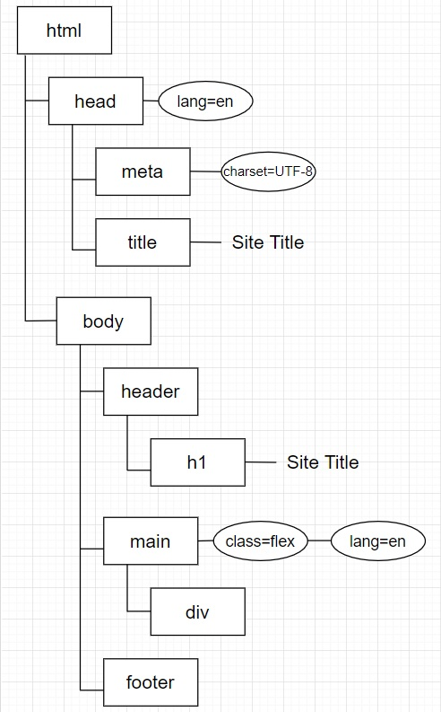

# JavaScript & the Document Object Model
The **D**ocument **O**bject **M**odel (**DOM**) connects web pages to scripts or programming languages by _representing the structure of a document_ — such as the HTML representing a web page — in memory.

**DOM methods** allow JavaScript programmatic access to the HTML document. With DOM Methods you can change the document's _structure_, _style_, or _content_.

## DOM Methods
### Selecting HTML Elements
To begin interacting with the HTML document, we first need to _select_ some _piece of the DOM_.

We can find elements by their HTML **tag name**, **class name**, or **ID**.
```javascript
//returns an array of all paragraph elements
document.getElementsByTagName("p");

// returns an array of all elements with the class "my-class"
document.getElementsByClassName("my-class")

// returns the (one) element with the id "my-ID"
document.getElementById("my-ID")
```

Another way to get HTML elements is through **`querySelector()`**. `querySelector()` takes in a CSS Selector and return the first HTML element that matches it. To return an array of every element that matches the CSS Selector use **`querySelectorAll()`**.
```javascript
// returns the first paragraph element
document.querySelector("p");

// returns the element with the id "my-ID"
document.querySelector("#my-ID");

// returns an array of all elements with the class "my-class"
document.querySelectorAll(".my-class");
```
---
### **Exercise 1 (Everyone)**
#### Practice selecting DOM elements: [1-Evr-SelectingDOMElements.js](4.1-Activities\1-Evr-SelectingDOMElements.js)
---
---
## The DOM Tree & Node Relationships
The DOM represents a document with a **logical tree**. Each branch of the tree ends in a _node_, and each node contains _objects_.

The nodes in the node tree have a _hierarchical relationship_ to each other, and the terms **parent**, **child**, and **sibling** are used to describe the relationships.

In a node tree, the top node is called the **root** node. _Every node_ has exactly **one parent**, _except the root_ (which has no parent). A node can have **a number of children**. **Siblings** are nodes with the _same parent_.

### DOM Tree Example
> **LEGEND**:
>
> **Rectangles** are _element_ nodes
>
> **Ovals** are _attributes_
>
> **Plain Text/No Border** is the _textContent_ of the element



[W3Schools DOM Tree](https://www.w3schools.com/js/pic_htmltree.gif)

#### Accessing Elements via Node Relationships
You can use the following node properties to **navigate** between nodes with JavaScript:

> **NOTE**: These node properties must be accessed from an element node. Ex: `document.querySelector('p').parentElement`

 - **.children** - returns an array-_like_ list of all of the element's children nodes
 - **.firstElementChild**
 - **.lastElementChild**
 - **.nextElementSibling**
 - **.parentElement**
---
### **Exercise 2 (Students)**
#### Practice navigating node relationships: [2-Stu-NodeRelationships.js](4.1-Activities\2-Stu-NodeRelationships.js)
---
---
## Changing HTML Elements
These node properties access different **pieces** of the element node:
- **.outerHTML** - access the "full" HTML of the element and all of its children
```javascript
// HTML includes:
// <header>
//  <h1>Site Title</h1>
// <header>
document.querySelector('header').outerHTML
// returns:
//  <header>
//    <h1>Site Title</h1>
//  <header>
```
- **.innerHTML** - access the inner HTML of the element, including the "full" HTML of its children
```javascript
document.querySelector('header').innerHTML
// returns: <h1>Site Title</h1>

document.querySelector(`header > h1`).innerHTML
// returns: Site Title
```
- **.textContent** - access _only_ the text of the HTML element and _only_ the text all of its children
```javascript
document.querySelector(`header`).textContent
// returns:
//
//  Site Title
//
document.querySelector(`header > h1`).textContent
// returns: Site Title

// HTML includes:
// <main>
//  <h2>Some Header</h2>
//  <p>Some text. <a href="https://www.lipsum.com/">Lorem ipsum.</a></p>
// </main>
document.querySelector('main > p').textContent
// returns: Some text. Lorem ipsum.
document.querySelector('main').textContent
// returns:
//
//  Some Header
//  Some text. Lorem ipsum.
//
```

- **.classList** - returns an array-_like_ DOMList of the element's classes. Properties of this array-_like_ DOMList include **.length** and **.value** (a single string that represents the _value_ of the HTML element's class _attribute_). You can access individual classes through _indexing_, just like an Array. To _alter_ the element's class list, use the following methods and pass in the name of the class:
   - .add()
   - .remove()
   - .toggle()
   - .replace()
   - .contains()

- **._attribute_** - where _attribute_ stands for the **name** of an attribute, returns the _value_ of the attribute. Ex: `.href`, `.src`, `.disabled`, etc.
```javascript
// original HTML:
// 
document.querySelector("#dog-photo")
        .src = "https://i2.pickpik.com/photos/774/556/1024/odin-male-australian-shepherd-dog-thumb.jpg";
// current HTML:
// 
```
- **.style** - [`.style`](https://developer.mozilla.org/en-US/docs/Web/API/HTMLElement/style) is used to get and set inline CSS styles.
```javascript
// Set multiple styles in a single statement
document.querySelector('main > p').style.cssText = "color: blue; border: 1px solid black";

// Set specific style while leaving other inline style values untouched
document.querySelector('main > p').style.color = "blue";
```
---
### **Exercise 3 (Everyone)**
#### Practice changing DOM elements: [3-Evr-ChangingElements.js](4.1-Activities\3-Evr-ChangingElements.js)
---
---
## Adding & Removing Elements
To add a new HTML element to the DOM, you must first _create_ the new element before _appending_ it. Use the following DOM methods to add or remove elements:
- .createElement()
- .appendChild()
- .removeChild(_child_) - deletes child from the _selected parent_ element
- .remove() - deletes _selected child_ element

```javascript
// create the new 'p' element
const newParagraph = document.createElement("p");
// append the new element as the last child element to 'main'
document.querySelector("main").appendChild(newParagraph);

// Two ways to delete the element:
// From the parent...
let childToRemove = document.querySelector("main").lastChild;
document.querySelector("main").removeChild(childToRemove);
// From the element itself...
childToRemove.remove();
```
---
### **Exercise 4 (Students)**
#### Practice creating elements: [4-Stu-CreatingElements.js](4.1-Activities\4-Stu-CreatingElements.js)
---
---
## Events & Event Handling
Nodes can also have **event handlers** attached to them. Once an _event_ is _triggered_, the event handlers get _executed_.

### Common Events
- `click`, `dblclick`
- `mousedown`, `mouseup`
- `mouseover`, `mouseout`
- `focus`, `blur`
- `keydown`, `keyup`, `keypress`

[MDN List of DOM Events](https://developer.mozilla.org/en-US/docs/Web/Events)

### Adding/Removing Event Listeners
- .addEventListener(_event_, _callback_)
- .removeEventListener(_event_, _callback_)
> **NOTE**: The callback in an event listener accepts a _single parameter_: **the Event object describing the event which has occurred**, and it returns nothing.
```javascript
// a callback function that doesn't use the Event object that was listened for
document.querySelector(".button")
        .addEventListener("click", () => console.log("The button was clicked."))

// a callback function that changes the background color of the target/"source" of the event
document.querySelector(".button")
        .addEventListener("click",
            (event) => event.target.style.background-color = "red")
```
---
### **Exercise 5 (Everyone)**
#### Practice with event listeners: [5-Evr-EventListeners.js](4.1-Activities\5-Evr-EventListeners.js)
---
---
